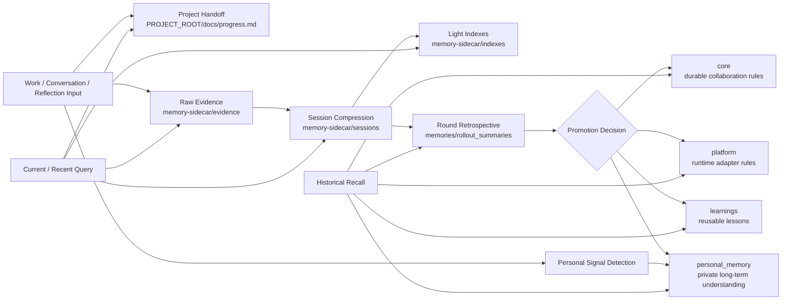

# Codex Long-Term Memory System (Sanitized)

A public, sanitized blueprint of a layered long-term memory system for coding agents.

中文说明请看: [README.zh-CN.md](./README.zh-CN.md)
Chinese docs in all key files use the `*.zh-CN.md` suffix.

## System Flow



## What this repository contains

- Layered memory architecture (`core / platform / learnings / rollout_summaries`)
- Memory lifecycle (capture -> classify -> deduplicate -> route -> review)
- Loading strategy (Ring0-Ring3 progressive loading)
- Safety gates for memory writes
- Distillation and recall workflows
- Execution-skill chain for post-task memory maintenance
- Default long-task handoff location: `PROJECT_ROOT/docs/progress.md`
- Optional runtime sidecar (`memory-sidecar/`) for evidence, sessions, and lightweight indexes
- Optional private `personal_memory/` branch for growth signals, private patterns, and self-understanding
- Migration pattern from legacy flat files to layered source-of-truth
- Executable bootstrap script for new projects
- Validator script and CI checks for enforceable quality gates
- Sanitized runnable examples

## Design goals

1. Single source of truth
2. Low maintenance cost
3. High signal, low pollution
4. Explicit boundaries among durable memory, retrospective memory, runtime session context, and private personal memory
5. Auditable structural changes

## Repository structure

- `docs/01-architecture.md` - architecture overview
- `docs/02-layer-model.md` - layer responsibilities and boundaries
- `docs/03-memory-lifecycle.md` - write/update/review lifecycle
- `docs/04-routing-and-loading.md` - loading and routing logic
- `docs/05-safety-and-governance.md` - safety, quality, and governance
- `docs/06-operations-and-audit.md` - operational practice and auditability
- `docs/07-migration-pattern.md` - minimal-delta migration pattern
- `docs/08-quickstart.md` - 15-minute executable quickstart
- `docs/09-execution-skills.md` - execution-skill chain and placement
- `docs/10-case-study.md` - one sanitized end-to-end memory chain walkthrough
- `templates/memory-item-template.md` - durable memory entry template
- `templates/distillation-report-template.md` - post-session distillation template
- `templates/commit-report-template.md` - commit-stage routing report template
- `skills/post-collaboration-distillation/` - installable distillation skill package
- `skills/memory-commit/` - installable commit-stage skill package
- `scripts/bootstrap.sh` - one-command layered memory scaffold
- `scripts/validate_memory.py` - memory schema and safety validator
- `checks/policy.json` - validator policy contract
- `.github/workflows/validate-memory.yml` - PR and mainline automation checks
- `examples/sanitized-memory/` - runnable sanitized example set
- `tests/fixtures/` - validator regression fixtures
- `tests/run_validator_fixtures.py` - fixture harness for CI and local checks

## Quickstart

```bash
bash scripts/bootstrap.sh /tmp/agent-memory
python3 scripts/validate_memory.py --root examples/sanitized-memory --policy checks/policy.json
python3 tests/run_validator_fixtures.py
```

See `docs/08-quickstart.md` for full setup.

## Sanitization policy

This repo intentionally removes:

- personal identifiers
- local absolute paths
- access tokens, credentials, and secrets
- private project names and business details

Use placeholders such as `$CODEX_HOME`, `PROJECT_ROOT`, and `AGENT_HOME`.

## Recommended adoption sequence

1. Read `docs/01-architecture.md`
2. Apply `docs/02-layer-model.md`
3. Enforce write gates from `docs/05-safety-and-governance.md`
4. Add audit trail from `docs/06-operations-and-audit.md`
5. Run migration checklist in `docs/07-migration-pattern.md`
6. Ask your own agent to migrate your legacy flat memory files into this layered structure and attach a `memory-sidecar/` only if runtime evidence recall is worth the extra complexity.
7. If you need a private personal-growth track, add a separate `personal_memory/` branch instead of mixing those signals into work memory by default.

## License

MIT
