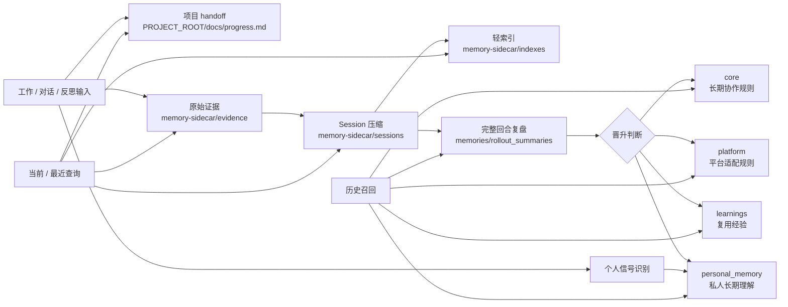

# Codex 长期记忆系统（脱敏版）

这是一个公开的、脱敏后的分层长期记忆系统蓝图，适用于编码代理协作场景。

英文版本请看: [README.md](./README.md)

关键文件中文版统一使用 `*.zh-CN.md` 后缀。

## 系统流程图



## 这个仓库包含什么

- 分层记忆架构（`core / platform / learnings / rollout_summaries`）
- 记忆生命周期（capture -> classify -> deduplicate -> route -> review）
- 加载策略（Ring0-Ring3 渐进加载）
- 记忆写入安全门
- 会后沉淀与历史召回流程
- 任务后记忆维护的执行技能链
- 可选的运行时 sidecar（`memory-sidecar/`），用于 evidence、sessions 与轻索引
- 可选的私人 `personal_memory/` 支线，用于成长信号、私人模式和长期自我理解
- 从扁平旧文件迁移到分层真源的最小增量模式
- 可执行的一键初始化脚本
- 可落地的校验器与 CI 质量门禁
- 基于 YAML 的 frontmatter 解析与聚焦 schema / 完整性校验
- 按 profile 校验：`minimal` 只守核心分层，`full` 才要求 sidecar 目录
- 仓库自带的 scaffold 和样例默认按 `full` profile 组织；下游接入时可以先从 `minimal` 起步，后续再补 sidecar。
- 可直接跑通的脱敏样例

## 设计目标

1. 单一真源
2. 低维护成本
3. 高信号、低污染
4. 长期记忆、复盘层、运行时上下文、私人记忆边界明确
5. 结构性改动可审计

## 仓库结构

- `docs/01-architecture.md`：架构总览
- `docs/02-layer-model.md`：分层职责与边界
- `docs/03-memory-lifecycle.md`：写入/更新/复盘生命周期
- `docs/04-routing-and-loading.md`：路由与加载策略
- `docs/05-safety-and-governance.md`：安全与治理规则
- `docs/06-operations-and-audit.md`：运维与审计实践
- `docs/07-migration-pattern.md`：最小增量迁移模式
- `docs/08-quickstart.md`：15 分钟可执行上手
- `docs/09-execution-skills.md`：执行技能链与放置方式
- `docs/10-case-study.md`：一条脱敏完整链路案例
- `templates/memory-item-template.md`：长期记忆条目模板
- `templates/distillation-report-template.md`：会后沉淀报告模板
- `templates/commit-report-template.md`：commit 阶段路由报告模板
- `skills/post-collaboration-distillation/`：可安装的 distillation 技能包
- `skills/memory-commit/`：可安装的 commit 阶段技能包
- `scripts/bootstrap.sh`：一键初始化分层记忆目录
- `scripts/validate_memory.py`：schema 与安全规则校验器
- `checks/policy.json`：校验策略契约
- `.github/workflows/validate-memory.yml`：PR 与主干自动校验
- `examples/sanitized-memory/`：可运行脱敏样例
- `tests/fixtures/`：validator 回归夹具
- `tests/run_validator_fixtures.py`：本地与 CI 共用的夹具测试入口

## 快速开始

```bash
bash scripts/bootstrap.sh /tmp/agent-memory
python3 -m pip install -r requirements.txt
python3 scripts/validate_memory.py --root examples/sanitized-memory --policy checks/policy.json --profile full
python3 tests/run_validator_fixtures.py
```

完整步骤见 `docs/08-quickstart.md`。

## 脱敏策略

本仓库有意移除了以下内容：

- 个人身份信息
- 本地绝对路径
- 访问令牌、凭证与密钥
- 私有项目名称与业务细节

请使用占位符，例如 `$CODEX_HOME`、`PROJECT_ROOT`、`AGENT_HOME`。

## 推荐落地顺序

1. 先读 `docs/01-architecture.md`
2. 套用 `docs/02-layer-model.md`
3. 启用 `docs/05-safety-and-governance.md` 的写入门禁
4. 增加 `docs/06-operations-and-audit.md` 的审计机制
5. 按 `docs/07-migration-pattern.md` 执行迁移检查单
6. 建议让你自己的 Agent 把旧的平铺记忆文件迁移到这套分层结构；只有在确实需要运行时证据召回时，再额外接入 `memory-sidecar/`。
7. 如果你需要私人长期成长支线，再单独接入 `personal_memory/`，不要默认和工作记忆混层。

## 许可证

MIT
